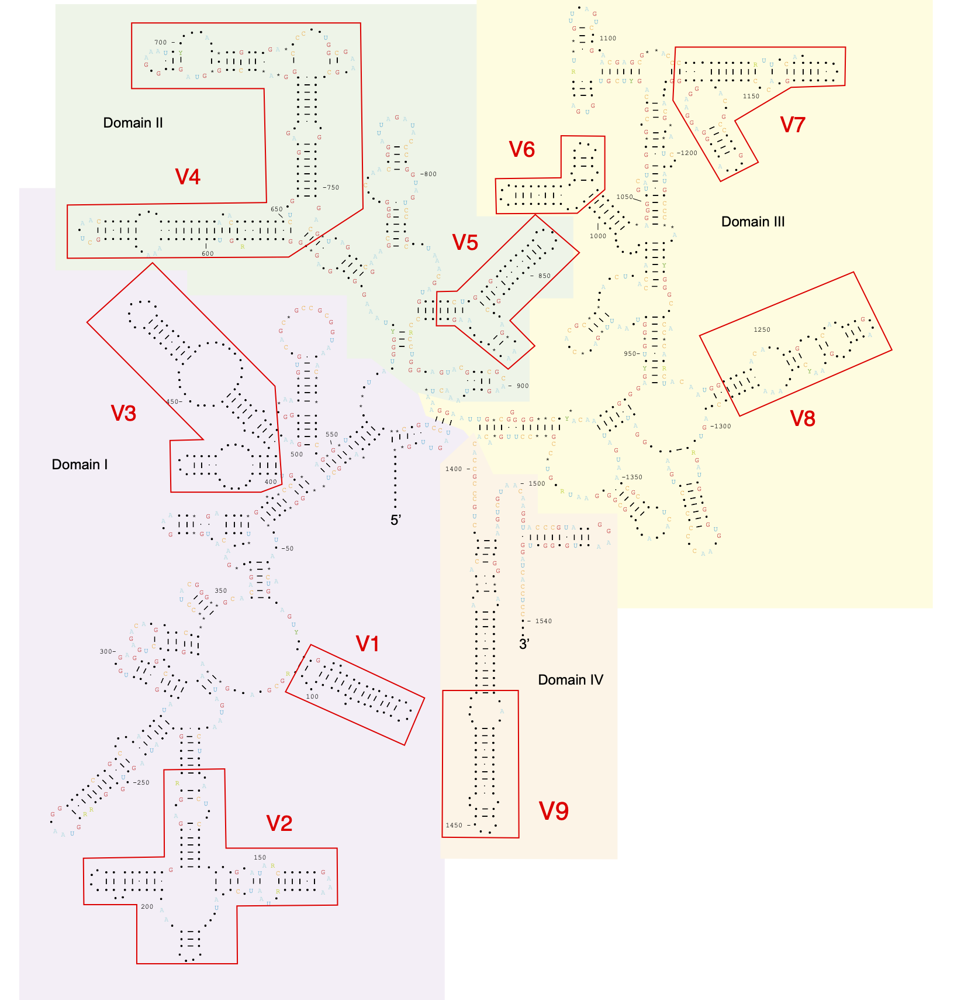
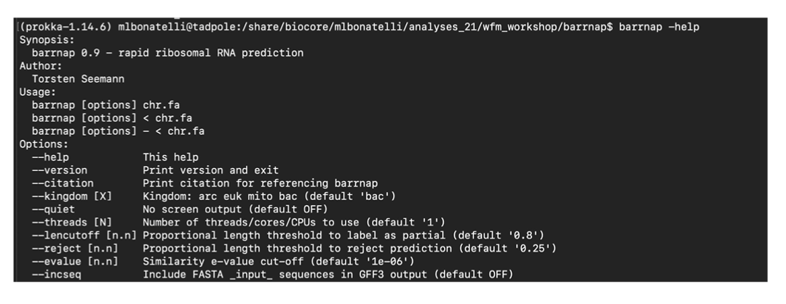
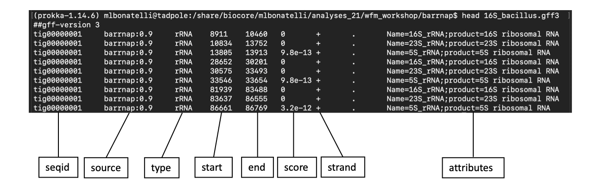
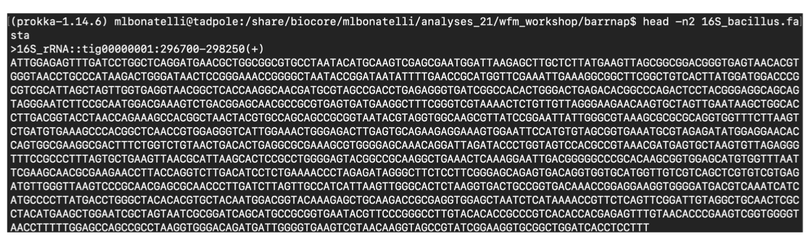
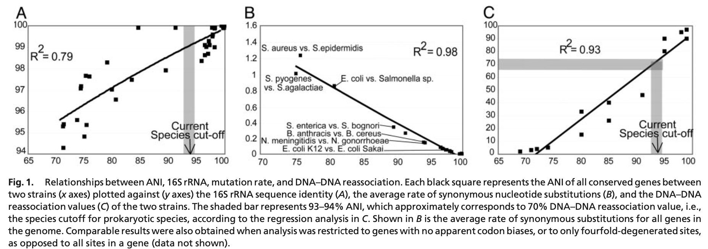
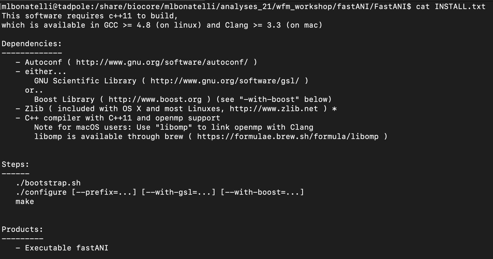
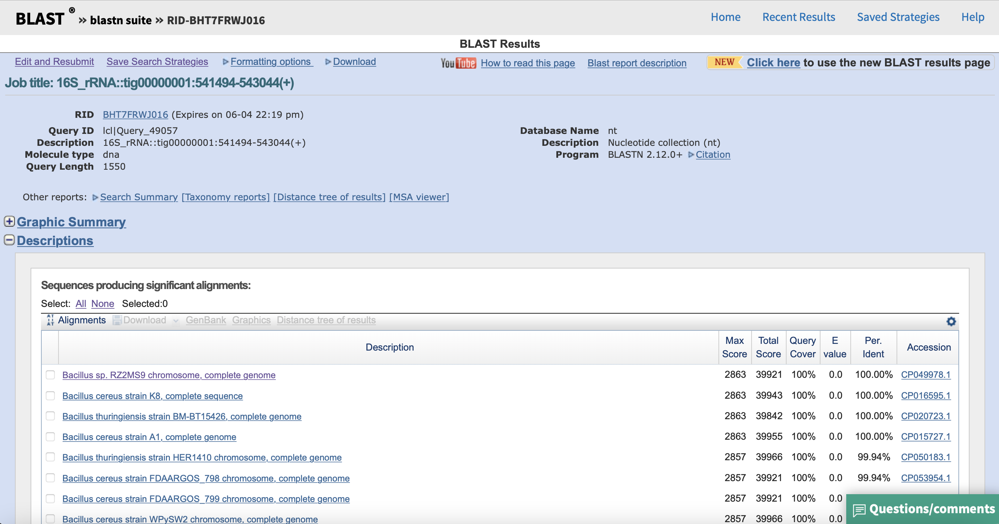
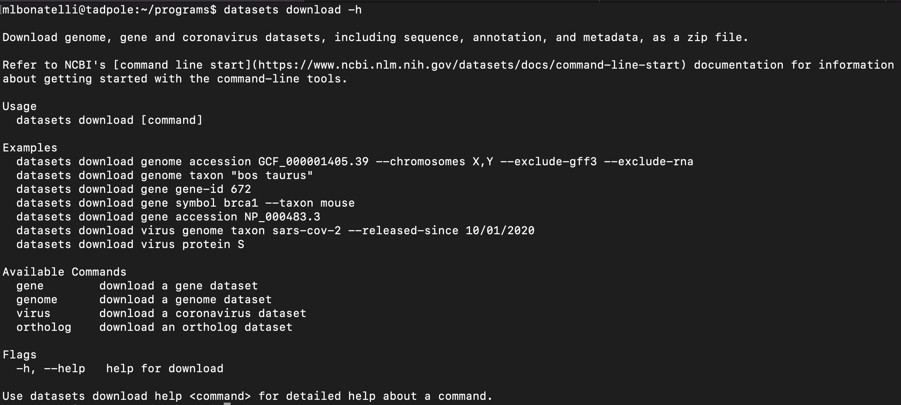
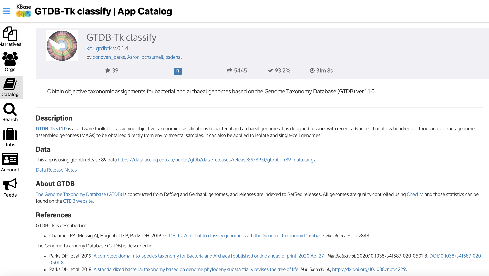

# Bacterial Taxonomy with Whole-genome Data
Dr. Maria Bonatelli; Univ. of São Paulo, Piracicaba, Brazil.

## Introduction to Bacterial Taxonomy

### What is bacterial taxonomy?

Bacterial taxonomy consists of three things: classification, nomenclature, and identification of bacteria.

Definition of [Cowan et al. 1964](https://www.microbiologyresearch.org/content/journal/micro/10.1099/00221287-39-1-143?crawler=true):

>(1) Classification, the orderly arrangement of units into groups of larger units. A simple analogy can be found in a pack of cards; the individual cards can first be sorted by color, then into suits. Within each suit the cards can be arranged in a numerical sequence, and the face cards placed in some order of seniority.
>
>(2) Nomenclature, the naming of the units defined and delineated by the classification. In the example of cards, the face cards are given names [...].
>
>(3) Identification of unknown units with known units of the classification developed in (1) and bearing names given in (2).

In the beginning, phenotypic characteristics were used to classify and identify bacteria (e.g., morphological and physiological). Now, we use a polyphasic taxonomy that integrates phenotypic, genotypic, and phylogenetic data to that end.

## 16S rRNA gene

### What is the 16S rRNA gene?
The 16S rRNA gene encodes for the structural element of the small subunit of the ribosome. This gene is ubiquitous in prokaryotes and due to the highly conserved nature of the 16S rRNA, it became an important phylogenetic marker for this group.

Interestingly, the 16S rRNA contains several conserved and variable regions – that are connect with its structure.

 

Stacy Yudina, CC BY-SA 4.0 <https://creativecommons.org/licenses/by-sa/4.0>, via Wikimedia Commons.

Such regions are target in phylogenetic studies, depending on the objective of the study.

For our purpose here today, we want to recover from the genome the full length rRNA gene, that has ~ 1,500 bp. Typically, we will consider for species circumscription of two bacterial isolates if they have 98.7% of rRNA 16S gene identity.

>Tip: If you have a new bacterial isolate that you want to identify it using 16S rRNA gene, you should use primers that target different regions of the gene to get the full-length 16S rRNA gene. In this publication of (Thompson et al. 2001)[ https://www.sciencedirect.com/science/article/pii/S0723202004700673] you can find a set of primers to that end.

### Using Barrnap to recover 16S rRNA gene from your genome sequence
You have a high-quality complete genome, and you want to find all ribosomal RNA gene. To that, you can use [Barrnap](https://github.com/tseemann/barrnap).

>Barrnap predicts the location of ribosomal RNA genes in genomes. It supports bacteria (5S,23S,16S), archaea (5S,5.8S,23S,16S), metazoan mitochondria (12S,16S) and eukaryotes (5S,5.8S,28S,18S).
>
>It takes FASTA DNA sequence as input, and write GFF3 as output. It uses the new ‘nhmmer’ tool that comes with HMMER 3.1 for HMM searching in RNA:DNA style.

To use Barrnap, you can install it via Conda or Homebrew/Linuxbrew, depending on your operational system. If you are working in a cluster, you can look for ‘prokka’ software that also runs barrnap. For more information about prokka, a cool software that performs whole genome annotation, [see here]( https://github.com/tseemann/prokka).

Once you have Barrnap ready to run, you will only need your genome in .fasta file. In this example, I am using Barrnap v. 0.9:

`barrnap --help`

`barrnap -o 16S_bacillus.fasta < bacillus.fasta > 16S_bacillus.gff3`

`head 16S_bacillus.gff3`

More information about .gff3 file [here](https://m.ensembl.org/info/website/upload/gff3.html).

Bacteria can have more than one copy of the 16S gene. Our isolate has 14 copies of this gene.

`head -n2 16S_bacillus.fasta`

Once you have one or more 16S rRNA genes from your genome, you can use different databases to identify your bacteria. I recommend three: 
1.	Ribosomal Database Project (RDP) [Classifier Tool](https://rdp.cme.msu.edu/help/CL.jsp) allows classification of both bacterial and archaeal 16S rRNA sequences to the taxonomical hierarchy.

2.	Silva rRNA database project [ACT: Alignment, Classification and Tree Service](https://www.arb-silva.de/aligner/).

>**SINA Aligner**
>SINA (v1.2.11) will align your rRNA gene sequences accoding to the global SILVA alignment for rRNA genes. The results can be combined with any other sequences aligned by SINA or taken from the SILVA databases by concatenation of FASTA files or using the ARB MERGE tool.
>
>**SINA Search and Classify**
>Enabling "Search and classify" will force SINA to additionally classify your sequences with the least common ancestor (LCA) method based on the taxonomies hosted by SILVA.

3.	Blastn of [National Center for Biotechnology Information (NCBI)](https://blast.ncbi.nlm.nih.gov/Blast.cgi).

## Average Nucleotide Identity (ANI)

### What is ANI?

When you have the whole-genome of a bacterial species, you should consider more robust methods to identify your bacterium than using only the 16S rRNA gene. A pragmatic species circumscription of two bacteria is when they have at least 70% of DNA–DNA hybridization, that corresponds to ~ 94% of the Average Nucleotide Identity (ANI). 

The ANI considers all protein-coding genes between two species to measure their genetic relatedness through alignment. [Konstantinidis and Tiedje (2005)](https://www.ncbi.nlm.nih.gov/pmc/articles/PMC549018/) showed that ANI strongly correlates with both 16S rRNA gene sequence identity and DNA–DNA reassociation values.

Figure from [Konstantinidis and Tiedje (2005)](https://www.ncbi.nlm.nih.gov/pmc/articles/PMC549018/).

Interestingly, there are several variations of the original ANI calculation algorithm. Some of them might consider the whole genome fragmented to perform the comparison, such as OrthoANI, while others will use genome-wide Average Nucleotide Identity (gANI).

### FastANI

Today, we will use [FastANI](https://github.com/ParBLiSS/FastANI) to identify our bacterial whole-genome. FastANI is an alignment-free computation of whole-genome ANI. This is a fast, yet reliable tool to perform bacterial identification against one particular isolate or a database.

First, we will need to install FastANI in our computer or server:

`git clone https://github.com/ParBLiSS/FastANI.git`

Then, we will follow the instructions on the **INSTALL.txt** file:

`cat INSTALL.txt`

`./bootstrap.sh`

`./configure --prefix=</path/to/install> --with-gsl=</path/to/gsl/> OR --with-boost==</path/to/boost/>`

`make`

Alternatively, you can install FastANI via [conda](https://anaconda.org/bioconda/fastani).

Now, FastANI is installed and ready to be used. You can manually look for bacterial isolates that are close to your genome on different databases, and you can use the previously recovered 16S rRNA gene of your genome to help you on this task. For example, if you use [Blastn]( https://blast.ncbi.nlm.nih.gov/Blast.cgi?PROGRAM=blastn&PAGE_TYPE=BlastSearch&LINK_LOC=blasthome) with megablast, you will see the following result:

Alternatively, you can download all the genomes close to your bacterial isolate with [datasets](https://www.ncbi.nlm.nih.gov/datasets/docs/command-line-start) from NCBI. Datasets is a command-line tool that is used to query and download biological sequence data from NCBI.

In our example, we downloaded all complete genomes of _Bacillus cereus_ group that were available at NCBI using their accession number. You can find the list [here](fig_bact_tax/accessions.txt).

First, we will compare our genome with a reference genome:

`./fastANI -q /path/to/bacillus.fasta -r /path/to/reference_genome.fasta -o /path/to/fastani_results.out`

Results:

`cat fastani_results.out`

**/path/to/bacillus.fasta /path/to/reference_genome.fasta 96.2886 1595	1785**

The previous result shows that ANI estimate between bacillus.fasta and reference_genome.fasta is 96.2886. Out of the total 1785 sequence fragments from _Bacillus_ genome, 1595 were aligned as orthologous matches.

Now, we will compare our genome with multiple reference genomes:

`./fastANI -q /path/to/bacillus.fasta --rl /path/to/reference_list.txt -o /path/to/fastani_results_multiple.out`

The result will be outputted in the same format, but with several lines, each line being a comparison between our genome and a reference genome.

`head -n3 fastani_results_multiple.out`

**/path/to/bacillus.fasta /path/to/reference_genome1.fasta 99.0552 1689    1785**

**/path/to/bacillus.fasta /path/to/reference_genome2.fasta 98.9125 1676    1785**

**/path/to/bacillus.fasta /path/to/reference_genome3.fasta 98.8536 1658    1785**

### Available online tools
#### GTDB-tk
[The Department of Energy Systems Biology Knowledgebase (KBase)]( https://www.kbase.us) provides in their catalog the [Genome Taxonomy Database (GTDB)](https://github.com/Ecogenomics/GTDBTk) that assigns objective taxonomic classifications to bacterial genomes.

#### MiGA
The Microbial Genomes Atlas Online (MiGA) is a webserver that allows the classification of a query sequence and that provides different tools to bacterial taxonomy and genome quality.

