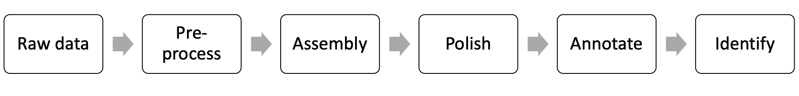
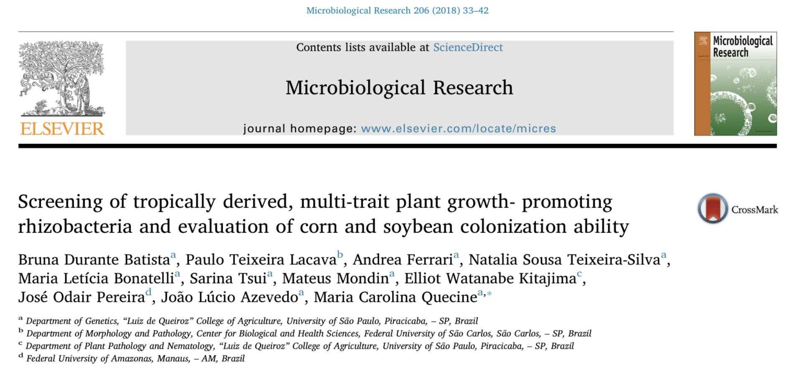

# Hands-on Workshop Assembling and Annotating Bacterial Genomes Using PacBio Long Reads

This workshop aims to provide to the participants the basic knowledge from beginning to end to assemble near-complete or complete high-quality bacterial genomes from PacBio long reads.

1. Introduction to PacBio sequencing data. Matthew Settles; Univ. of California, Davis, Davis, CA
2. Bacterial genome assembling with PacBio data. Hannah Lyman; Univeristy of California, Davis, Davis, CA
3. Annotating High-quality Bacterial Genomes. Jie Li; Univ. of California, Davis, Davis, CA
4. Bacterial Taxonomy with Whole-genome Data. Maria Bonatelli; Univ. of São Paulo, Piracicaba, Brazil

## The bacterium _Bacillus thuringiensis_ RZ2MS9
Today, you will assemble the genome of a bacterium that was isolated from the Amazon rainforest, in the city of Maués, Amazonas state, Brazil. 
This bacterium was isolated from the rizosphere of guarana plants (_Paullinia cupana_).

  

The _Bacillus thuringiensis_ RZ2MS9 is a plant growth-promoting bacteria, so it harbors several genes related with plant growth-promoting traits, such as the production of indole acetic acid, solubilization of phosphate, and more.

Read the paper: [Batista et al. 2018](https://www.sciencedirect.com/science/article/pii/S0944501317309229).
