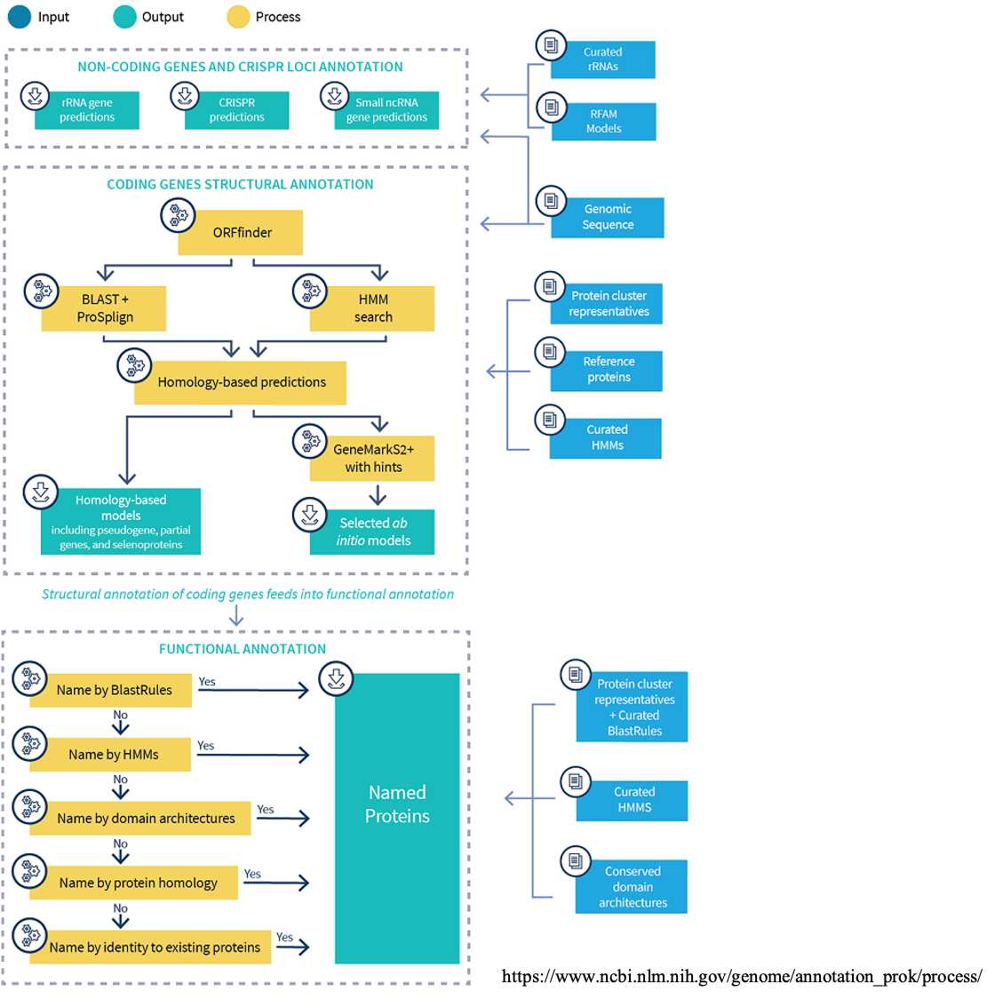

# Annotating Bacterial Genomes, with a focus on PGAP

Annotating a bacterial genome involves two major steps: structural annotation and functional annotation. Structural annotation is to identify all relevant genomic sequences for protein coding genes, structural RNA genes, as well as other types of genomic features. The predicted protein coding gene sequences will be used for functional annotation to predict the functions of the proteins, and/or relationship to known pathways.

There are a few annotation pipelines designed for annotating bacterial genomes.

1. NCBI's Prokaryotic Genome Annotation Pipeline (PGAP)
2. Prokka [prokarytoic annotation](https://github.com/tseemann/prokka)
3. RAST [Rapid Annotations using Subsystem Technology](https://rast.nmpdr.org/)
4. DRAM [Distilled and Refined Annotation of Metabolism](https://github.com/shafferm/DRAM)

## Introduction to PGAP
Running PGAP annotation for newly assembled bacterial genomes is easy to setup and the requirement in computing resources is reasonable (8 CPUs with 16GB memory or higher, and minimum 80GB disk space). The advantages of using PGAP is not only that it produces NCBI/GenBank recognized file formats, but also the extremely well organized and curated databases used in PGAP. 

## Running PGAP
The computing resources required by PGAP is a machine has 8 CPUs and minimum 2GB memory per CPU. Though I have successfully run PGAP on a laptop that has 4 Cores and 32GB memory. So, the number of CPUs could be lower than 8, but the memory per CPU should be sufficient. Otherwise, one important step in the pipeline (blastp) will fail. PGAP can be run quite easily using docker. The first step in setting up the environment for running PGAP is to install docker on your laptop, or on an AWS instance. Simply download the proper version of [docker](https://docs.docker.com/get-docker/). The second package required for PGAP is python3.6 or higher. This could be easily installed by installing [Anaconda](https://www.anaconda.com/products/individual#Downloads) on your machine.

*For those who have chosen to use an AWS instance that is Ubuntu platform, after installing docker following the instruction on the [docker website](https://docs.docker.com/engine/install/ubuntu/), please execute the following commands so that the docker engine is avaible for PGAP scripts.*

    sudo groupadd docker
    sudo usermod -aG docker ${USER}

*Then please logout of the AWS instance and re-login to have the group membership re-evaluated.*

In order to check whether docker is available, please execute the following command:

    docker run hello-world

If this command has executed successfully, you should see a message stating that the "installation appears to be working correctly".

Once the above two components are properly installed, one could follow the instructions below to obtain PGAP, as well as the most up-to-date databases.

    curl -OL https://github.com/ncbi/pgap/raw/prod/scripts/pgap.py
    ./pgap.py --update

The input to PGAP is the final assembled genome fasta file. One could download the file using the following command **if the previous assembly step has not finished**.

    wget https://bioshare.bioinformatics.ucdavis.edu/bioshare/download/ua4gjm2jyj12oxl/baccanu.contigs.fasta

For those who have Windowns machines, the file could be found [here](https://bioshare.bioinformatics.ucdavis.edu/bioshare/view/2021-ASM-genome-assembly/). Please right click on the file *baccanu.contigs.fasta* and save it to your working directory.

There are two YAML files (*input.yaml* and *submol.yaml*) that are required by PGAP for metadata and pipeline parameters. You can download them [here](https://bioshare.bioinformatics.ucdavis.edu/bioshare/view/2021-ASM-genome-assembly/annotation_inputs/) the same way as you have downloaded the fasta file above.

Now we are ready to run PGAP. The following command will run the full PGAP pipeline.

    ./pgap.py -r -o baccanu_anno ./input.yaml

