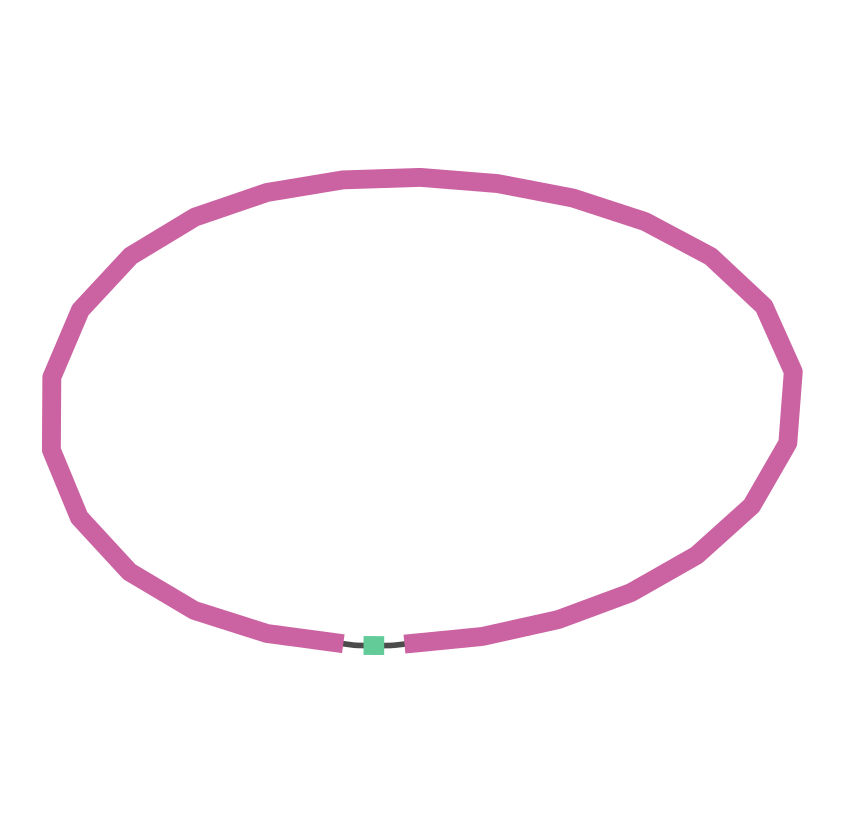

# Assembly, Assembly Metrics, and Quality Control

*Dr. Hannah Lyman, University of California, Davis*

## Assembling a bacterial genome with PacBio sequence data

The data and pipeline in this tutorial are adapted from [**Complete Genome Sequence of *Bacillus* sp. Strain Rz2MS9, a Multitrait Plant Growth Promoter**](https://journals.asm.org/doi/full/10.1128/MRA.00623-20 When referring to this pipeline, please cite the publication.

### Explore the sequence data

We will be working with two PacBio sequencing runs from a *Bacillus* species. Before we begin the assembly, we can first take a look at the reads, beginning with the demultiplexed output from Lima.

#### How many reads are there?

The bam stats tool from [bamutil](https://github.com/statgen/bamUtil/releases/tag/v1.0.14) allows us to quickly count the reads in each run.

    mkdir 01-bamStats
    bam stats --in 00-RawData/isi_run_01/lima_output.bc1002_BAK8A_OA--bc1002_BAK8A_OA.bam \
              --basic \
              2> 01-bamStats/isi_run_01.txt # redirect stderr to output file
    bam stats --in 00-RawData/isi_run_02/lima_output.bc1002_BAK8A_OA--bc1002_BAK8A_OA.bam \
              --basic \
              2> 01-bamStats/isi_run_02.txt

#### What does the ZMW count distribution look like?

First, we will need to count the occurrence of each ZMW. Using [samtools/1.9](https://github.com/samtools/samtools/releases/tag/1.9) and a few basic text manipulation tools on the command line, we can derive a comma separated counts table of ZMWs from the PacBio read data. The multi-line command below will:

1. Create a CSV file containing a header
2. Convert from SAM to BAM
3. Extract the read name field from the SAM formatted read file
4. Extract the ZMW from the read name
5. Sort ZMWs as a prerequisite to counting occurences
6. Display counts for each ZMW
7. Remove excess whitespace
8. Reorder columns, separating them with a comma
9. Append output to the CSV

    mkdir 03-zmwCounts
    echo "zmw,counts" > 03-zmwCounts/isi_run_01.csv
    samtools view 00-RawData/isi_run_01/lima_output.bc1002_BAK8A_OA--bc1002_BAK8A_OA.bam | \
    cut -f1 | \
    cut -d '/' -f2 | \
    sort | \
    uniq -c | \
    tr -s ' ' | \
    awk -F ' ' '{print $2 "," $1}' \
    >> 03-zmwCounts/isi_run_01.csv
    echo "zmw,counts" > 03-zmwCounts/isi_run_02.csv
    samtools view 00-RawData/isi_run_02/lima_output.bc1002_BAK8A_OA--bc1002_BAK8A_OA.bam | \
    cut -f1 | \
    cut -d '/' -f2 | \
    sort | \
    uniq -c | \
    tr -s ' ' | \
    awk -F ' ' '{print $2 "," $1}' \
    >> 03-zmwCounts/isi_run_02.csv

The ZMW counts CSV files can be imported into R for summary statistics and visualizations.

    run_01 <- read.csv("03-zmwCounts/isi_run_01.csv")
    dim(run_01)
    [1] 8274    2
    sum(run_01$counts)
    [1] 66292
    summary(run_01$counts)
    Min. 1st Qu.  Median    Mean 3rd Qu.    Max.
    1.000   2.000   7.000   8.012  12.000  97.000
    run_02 <- read.csv("03-zmwCounts/isi_run_02.csv")
    dim(run_02)
    [1] 15686     2
    sum(run_02$counts)
    [1] 122450
    summary(run_02$counts)
    Min. 1st Qu.  Median    Mean 3rd Qu.    Max.
    1.000   2.000   6.000   7.806  11.000 183.000

While the second run has approximately twice as many ZMW as the first, the distribution of ZMW counts is similar between the two runs.

### Correct HiFi reads with circular consensus sequencing

It is possible to assemble uncorrected PacBio [HiFi](https://www.pacb.com/smrt-science/smrt-sequencing/hifi-reads-for-highly-accurate-long-read-sequencing/) reads, and we will try that as well to explore this data. However, circular consensus sequencing (CCS) produces a better assembly. CCS uses sub-reads to generate much more accurate sequence. In order to convert our HiFi to CCS, we will run PacBio's [ccs/4.0.0](https://github.com/PacificBiosciences/ccs/releases/tag/v4.0.0).

    ccs --reportFile=04-CCS/isi_run_01.report \
         00-RawData/isi_run_01/lima_output.bc1002_BAK8A_OA--bc1002_BAK8A_OA.bam \
         04-CCS/isi_run_01.ccs.bam

    ccs --reportFile=04-CCS/isi_run_02.report \
        00-RawData/isi_run_02/lima_output.bc1002_BAK8A_OA--bc1002_BAK8A_OA.bam \
        04-CCS/isi_run_02.ccs.bam

### Assemble the genome

The CCS reads are ready to assemble. [Canu](https://canu.readthedocs.io/en/latest/index.html) takes FASTA formatted reads as input, so we will need to convert our BAM formatted CCS reads to FASTA using samtools.

    samtools fastq 04-CCS/isi_run_01.ccs.bam > 04-CCS/isi_run_01.ccs.fq
    samtools fastq 04-CCS/isi_run_02.ccs.bam > 04-CCS/isi_run_02.ccs.fq
    mkdir 05-canu
    canu -assemble \
         useGrid=False \
         -p bacillus \
         -d 05-canu \
         genomeSize=5.5m \
         -pacbio-corrected 04-CCS/isi_run_01.ccs.fq 04-CCS/isi_run_02.ccs.fq

Two contigs are produced. This visualization of the assembly was created in [Bandage](https://rrwick.github.io/Bandage/).

### Polish the assembly using PacBio reads

PacBio's [GenomicConsensus](https://github.com/PacificBiosciences/GenomicConsensus) package includes tools for variant calling and polishing. Here we use the arrow algorithm, version 2.3.3. GenomicConsensus's variantCaller tool uses a file of file names ([FOFN](https://pb-falcon.readthedocs.io/en/latest/tutorial.html#create-fofn)), which is simply a text file containing the path to each read file. Before running variantCaller, we need to align the PacBio reads to the assembly and index the assembly FASTA file.

    mkdir 06-arrow
    ls 00-RawData/isi_run_0*/*.bam > raw.fofn
    pbalign raw.fofn 05-canu/bacillus.contigs.fasta 06-arrow/raw_canu_align.bam
    samtools flagstat 06-arrow/raw_canu_align.bam -O tsv > 06-arrow/samFlags.tsv
    samtools faidx 05-canu/bacillus.contigs.fasta
    variantCaller 06-arrow/raw_canu_align.bam \
                  --algorithm=arrow \
                  -r 05-canu/bacillus.contigs.fasta \
                  -o 06-arrow/variants-raw.gff \
                  -o 06-arrow/bacillus.arrowcorrected.fasta

### Incorporate short read data

In addition to the two PacBio runs, we have a paired-end Illumina library. Before the development of CCS, it was common practice to perform error correction on long read assemblies using more accurate short read technology. CCS reads are generally so accurate that this is not necessary. However, since we have the data, we will use it.

#### Preprocess reads

Before aligning the Illumina reads to the PacBio contigs, we will preprocess the reads to remove contaminants, duplicates, and low quality sequence using [HTStream](https://s4hts.github.io/HTStream/).

    mkdir 07-HTStream
    hts_Stats          --stats-file 07-HTStream/genomeStats.log \
                       --notes "initial statistics" \
                       --read1-input 00-RawData/RZ2M29_S1_L001_R1_001.fastq.gz \
                       --read2-input 00-RawData/RZ2M29_S1_L001_R2_001.fastq.gz | \
    hts_SeqScreener    --append-stats-file 07-HTStream/genomeStats.log \
                       --notes "remove PhiX" | \
    hts_SuperDeduper   --append-stats-file 07-HTStream/genomeStats.log \
                       --notes "deduplicate using 10bp key at 10th position" | \
    hts_Overlapper     --append-stats-file 07-HTStream/genomeStats.log \
                       --notes "merge pairs with >= 8bp overlap, with < 100 mismatches and >= 75% identity in overlapping region" | \
    hts_QWindowTrim    --append-stats-file 07-HTStream/genomeStats.log \
                       --notes "remove low quality bases from ends of reads. minimum window quality 20" | \
    hts_NTrimmer       --append-stats-file 07-HTStream/genomeStats.log \
                       --notes "return longest subsequence containing no Ns" | \
    hts_LengthFilter   --append-stats-file 07-HTStream/genomeStats.log \
                       --notes "remove all reads < 200bp, and all orphaned reads" \
                       --min-length 200 \
                       --no-orphans | \
    hts_Stats          --append-stats-file 07-HTStream/genomeStats.log \
                       --notes "final statistics" \
                       --fastq-output 07-HTStream/illumina.htstream

#### Align reads to assembly

The preprocessed reads can now be aligned to the assembly. We will use [bwa-mem2](https://github.com/bwa-mem2/bwa-mem2), a very fast aligner, followed by samtools to reformat, sort, and index the reads, and collect alignment statistics.

    mkdir 08-pilon
    bwa-mem2 index 06-arrow/bacillus.arrowcorrected.fasta
    bwa-mem2 mem 06-arrow/bacillus.arrowcorrected.fasta 07-HTStream/illumina.htstream_SE.fastq.gz | \
    samtools view -bS | samtools sort > 08-pilon/bacillus.arrowcorrected.SE.bam
    bwa mem 06-arrow/bacillus.arrowcorrected.fasta 07-HTStream/illumina.htstream_R1.fastq.gz 07-HTStream/illumina.htstream_R2.fastq.gz | \
    samtools view -bS | samtools sort > 08-pilon/bacillus.arrowcorrected.PE.bam
    samtools flagstat 08-pilon/bacillus.arrowcorrected.SE.bam -O tsv > 08-pilon/samFlags_SE.tsv
    samtools flagstat 08-pilon/bacillus.arrowcorrected.PE.bam -O tsv > 08-pilon/samFlags_PE.tsv
    samtools index 08-pilon/bacillus.arrowcorrected.SE.bam
    samtools index 08-pilon/bacillus.arrowcorrected.PE.bam

#### Polish assembly using short read data

[Pilon](https://github.com/broadinstitute/pilon/wiki) is a tool from the Broad Institute designed to identify small and large indels, block substitutions, local misassemblies, and single-base differences between the input genome and the provided reads.

    pilon --genome 06-arrow/bacillus.arrowcorrected.fasta \
          --frags 08-pilon/bacillus.arrowcorrected.PE.bam \
          --unpaired 08-pilon/bacillus.arrowcorrected.SE.bam \
          --output 08-pilon/bacillus.pilon \
          --changes \
          --vcfqe \
          --tracks

### Make final adjustments

1. Look for overlap between beginning and end of genome
2. Verify genome strand using blast
3. Search for chromosomal replication initiator protein DnaA

    samtools faidx 08-pilon/bacillus.pilon.fasta --reverse-complement contig:10037-end --output 08-pilon/bacillus.pilon.trimmed.rc.fasta

*in bash shell*

`bedtools getfasta -fi Final_Genome_trimmed_and_RC.fasta -bed position1.bed -fo Final_Genome_trimmed_and_RC_beg.fasta
bedtools getfasta -fi Final_Genome_trimmed_and_RC.fasta -bed position2.bed -fo Final_Genome_trimmed_and_RC_end.fasta
grep -v ">" Final_Genome_trimmed_and_RC_beg.fasta | wc | awk '{print $3-$1}'
843381

grep -v ">" Final_Genome_trimmed_and_RC_end.fasta | wc | awk '{print $3-$1}'
4513813

843381 + 4513813 = 5357194

grep -v ">" Final_Genome_trimmed_and_RC.fasta | wc | awk '{print $3-$1}'
5357194

You can manually join them.

grep -v ">" Final_Genome_trimmed_and_RC_total.fasta | wc | awk '{print $3-$1}'
5357194`

## Assembly Metrics and Quality Control

How well assembled is the genome? What are its characteristics? We can look at a few different metrics to get an idea of whether or not the assembly meets our expectations for the genome in terms of composition and contiguity, completeness, and correctness.

### Composition

To calculate the sequence composition of the genome,

### Contiguity

The size of an assembled genome tells us only how many base pairs of assembled sequence were generated. Looking only at assembly size, we have no way of knowing how those base pairs are distributed. Is this 5.5 MB assembly in 1 KB pieces? Ideally, an assembly is highly contiguous, with a single assembled sequence representing each chromosome or plasmid. We will look at two measures of assembly contiguity: N50 and L50.

#### N50

The N50 of an assembly is the length of the shortest contig in 50% of the total genome length. This calculated by ordering contigs from longest to shortest, summing lengths until reaching 50% of the total genome size, and reporting the length of the shortest contig used.

In a perfectly assembled single chromosome genome, the N50 and the size of the assembled genome will be identical. In a highly fragmented assembly, the N50 may be very small, as many small contigs will need to be included to reach 50% of the genome size.

#### L50

The L50 is the smallest number of contigs whose length total at least 50% of the genome size. This is the number of contigs used in the N50. A lower number represents higher contiguity.

### Completeness and correctness

The assembly size is very similar to the expected genome size.
