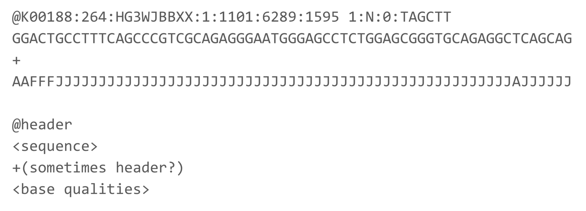
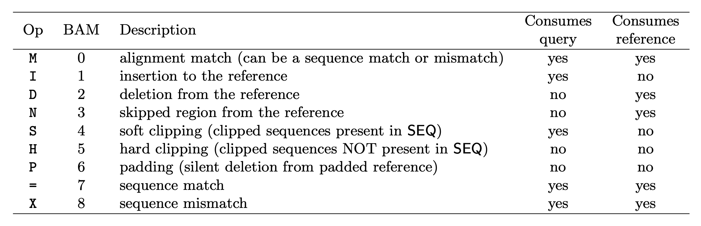

<style>
table {
    width:60%;
}
</style>

# DNA Sequencing, the long and the short of it.

*Matt Settles, PhD, University of California, Davis*


The ASM Recording that accompanies this section can be found [here](https://video.ucdavis.edu/media/ASM_Settles_Part1/1_ax504uio)


## Introduction to PacBio Sequencing

Pacific Biosciences (PacBio) was founded in 2004 with its underlying technology: Single Molecule, Real-Time (SMRT) Sequencing. Its first commercial sequencer (the RS) was released in 2010. Since that time there have been 4 sequencer updates: RS II, Sequel, Sequel 2, Sequel 2e.


|                                     | Sequel IIe System |
| ----------------------------------- | ----------------- |
| Supported SMRT Cell                 | SMRT Cell 8M      |
| Number of HiFi Reads >99%* Accuracy | Up to 4,000,000   |
| Sequencing Run Time per SMRT Cell   | Up to 30 hrs      |

### PacBio's Main Features Include:

#### Long Reads
- Tens of kilobases
- Sequence from 500 bp to >50,000 bp inserts

#### High Accuracy
- Free of systematic errors
- Achieves >99.999% (Q50) consensus accuracy

#### Single-Molecule Resolution
- Sequence DNA or RNA
- Long reads with ≥Q20 (99%) single-molecule accuracy

#### Uniform Coverage
- No DNA amplification
- Least GC content and sequence complexity bias

#### Simultaneous Epigenetic Detection
- Characterize epigenome
- No separate sample preparation required

### The Basics of Sequencing on PacBio


### The SMRTbell produces polymerase reads


PacBio "movies" generate zmw polymerase reads that are comprised of the bell adapter, template forward strand subread, bell adapter, template reverse strand subread. Highly accurate long reads are then produced by the circular consensus sequence (CCS).

#### PacBio sequecing has two modes
- Continuous Long Reads: : Reads with a subread length approximately equivalent to the polymerase read length indicating that the sequence is generated from a single continuous template from start to finish. The CLR sequencing mode emphasizes the longest possible reads.
- HiFi Reads: The consensus sequence resulting from alignment between subreads taken from a single ZMW. Generating a CCS read does not include or require alignment against a reference sequence but does require at least two full-pass subreads from the insert. CCS reads are advantageous for amplicon and RNA sequencing projects and are highly accurate (>99% accuracy, Q>20).


Reads length distribution


The differences in the 2 modes of sequencing are in movie times: 15hrs for CLR and 30hrs for HiFi and in pre-extension times: 2hrs for CLR and 0 for HiFi.

Pre-extension is a software feature that allows SMRTbell molecules to reach rolling circle replication (when the polymerase is most stable) before movie collection is initiated.

#### Benefits of HiFi
- Highly accurate de novo assembly
- Detect all variants types with high precision and recall
- Detect 5% more variants in “medical exome” - Phase variants into haplotypes
- Sequence full-length transcripts
- Explore metagenomes in high resolution

Pacific Biosystems [You Tube](https://www.youtube.com/user/PacificBiosciences) channel has many quality videos that further explains their technology and applications.

## Best Practices for Microbial Genome Sequencing

The PacBio Sequel 2e theoretical maximum sequencing would be 4 million ZMW * average 20Kb CCS molecule length = 8e+10 base pairs. For the average 4Mb microbe, that implies 20,000X coverage. While we dont expect to ever achieve that theoretical maximum, regardless we have significant single genome coverage. We can then barcode our libraries (up to 48) and multiplex multiple microbial genomes in 1 8M SMRT Cell. Multiplexing 48 samples and the theoretical maximum reduces our per genome coverage to ~415x. Still > 10X more data we need to confidently assemble a microbial genome. This gives us significant leeway in sequencing performance and read results, allowing us (if desired) to pick and choose the best reads to assemble with.

#### Some of the best practices and expectations to consider for Microbial Genome Sequencing with PacBio are:
- Start with the recommended input of highquality DNA (1.0 μg) per genome.
- Library insert size 10-15Kb.
- \>30X Unique molecular coverage per genome.
    - \>10X CCS coverage per genome.
- Multiplex samples to assemble most bacterial genomes into 5 contigs or fewer, exclusive of plasmids.
- Up to 48 isolates in a single SMRT Cell 8M
    - Multiplex up to 16 samples per SMRT Cell 1M
- Closure of class III complexity genomes with large repeat regions may require size-selected 20-30 kb libraries and may not be suitable for multiplexing.
- Achieve high-quality consensus accuracies \>99.999%
- Detect and annotate active m6A and m4C R-M system motifs with the ‘Base Modification and Motif Analysis’ workflow.

## PacBio Workshop Data

First, create a directory for this workshop. This directory will be created where ever you currently are in your bash terminal. If you just opened the terminal this is probably your 'home' directory. Change directory (cd) to where ever you'd like to first.

```bash
pwd
mkdir -p mga_workshop
cd mga_workshop
```

Then lets create a Raw Data folder and download the raw data files from the Bioshare.

```bash
mkdir 00-RawData
cd 00-RawData/

wget -r --level=10 -nH -nc --cut-dirs=3 --no-parent --reject "wget_index.html" --no-check-certificate --header "Cookie: sessionid=cesl1gwe6tdy2b04jux51klo4509d46b;" https://bioshare.bioinformatics.ucdavis.edu/bioshare/wget/ua4gjm2jyj12oxl/isi_run_01/wget_index.html

wget -r --level=10 -nH -nc --cut-dirs=3 --no-parent --reject "wget_index.html" --no-check-certificate --header "Cookie: sessionid=cesl1gwe6tdy2b04jux51klo4509d46b;" https://bioshare.bioinformatics.ucdavis.edu/bioshare/wget/ua4gjm2jyj12oxl/isi_run_02/wget_index.html

wget https://bioshare.bioinformatics.ucdavis.edu/bioshare/download/ua4gjm2jyj12oxl/Illumina/RZ2M29_S1_L001_R1_001.fastq.gz

wget https://bioshare.bioinformatics.ucdavis.edu/bioshare/download/ua4gjm2jyj12oxl/Illumina/RZ2M29_S1_L001_R2_001.fastq.gz
```

This will download 2 folders (isi_run_01 and isi_run_02) into the 00-RawData directory and 2 files (RZ2M29_S1_L001_R1_001.fastq.gz and RZ2M29_S1_L001_R1_001.fastq.gz).

**These files may take some time to download so I recommend pausing the recording while they do**

If we take a look at one of the PacBio runs:

```bash
cd isi_run_01
ls
```

You will find limma demultiplexing output files, sample bam (and index) files, and sample fastq files.


```bash
cat lima_output.lima.summary
```

> ZMWs input                (A) : 30655
> ZMWs above all thresholds (B) : 18891 (62%)
> ZMWs below any threshold  (C) : 11764 (38%)
>
> ZMW marginals for (C):
> Below min length              : 18 (0%)
> Below min score               : 0 (0%)
> Below min end score           : 0 (0%)
> Below min passes              : 0 (0%)
> Below min score lead          : 344 (3%)
> Below min ref span            : 96 (1%)
> Without adapter               : 11392 (97%)
> Undesired diff barcode pairs  : 22 (0%)
>
> ZMWs for (B):
> With same barcode             : 18891 (100%)
> Coefficient of correlation    : 22.21%
>
> ZMWs for (A):
> Allow diff barcode pair       : 13393 (44%)
> Allow same barcode pair       : 19263 (63%)
>
> Reads for (B):
> Above length                  : 132486 (100%)
> Below length                  : 164 (0%)

&nbsp;

#### Each Bam line looks like


> m54358_191123_155756/4194862/0_73	4	*	0	255	*	*	0	0	ATTACACATCATAACGTACTTCAAGAGCTTCGCATGCCTAGAGCAATAGGTTGCTAGTTTTTCAGGTGCCTTT	!!!!!!!!!!!!!!!!!!!!!!!!!!!!!!!!!!!!!!!!!!!!!!!!!!!!!!!!!!!!!!!!!!!!!!!!!	RG:Z:b1364beb	ip:B:C,4,7,4,1,5,13,6,5,15,11,12,3,12,32,4,14,2,4,23,32,7,14,21,3,1,1,24,6,0,5,5,0,0,7,14,3,2,2,11,8,6,19,21,1,0,11,9,3,9,5,20,7,5,6,71,10,5,0,21,14,3,15,27,23,67,6,19,25,15,22,34,2,3	np:i:1	pw:B:C,20,8,6,10,4,4,19,4,2,7,10,8,5,4,21,10,5,17,2,14,4,39,3,17,24,15,11,7,9,10,16,23,27,13,10,4,14,8,29,5,4,41,22,34,6,7,15,22,8,3,9,3,19,13,4,29,36,8,4,18,6,2,49,26,54,18,17,14,14,5,18,17,28	rq:f:0.8	sn:B:f,6.15196,11.3958,6.82309,11.6206	zm:i:4194862	qs:i:0	qe:i:73	bc:B:S,1,1	bq:i:82	cx:i:10

&nbsp;

#### The header line of a PacBio fastq file look like

> @m54358_191123_155756/4194862/0_73

&nbsp;

# Files and File Types

The primary file types you'll see related to DNA sequence analysis are:

* [fasta](#fasta)
* [fastq](#fastq)
* [gtf/gff](#Annotation-based-file-types)
* [sam/bam/cram](#Alignment-based-file-types)
* [bed](#Bed-file-types)

## Sequence based file types
Sequence based files first started out as fasta with paired qual files (Sanger and 454), with Illumina and quality scores being used more, the fastq file became the default output from DNA sequencers. These days additional file types are being used, including fast5 by Oxford Nanopore and 'unmapped' bam files by Pacific Biosciences.


### fasta
The fasta format uses the '>' to indicate a new sequence followed by the name of the sequence on the same line. The following line(s) are the DNA sequence and may be split on multiple lines (wrapped), until the next '>' is reached. Genome and transcriptome files are most often in fasta format.


Qual files are so rarely used these days and so are not discussed.

### fastq
fastq files combine the sequence and quality scores into 1 file. Each sequence here has 4 lines (should be enforced strictly), header, sequence, historical '+', and quality.



CASAVA 1.8 Read IDs

@EAS139:136:FC706VJ:2:2104:15343:197393 1:Y:18:ATCACG
* EAS139 the unique instrument name
* 136 the run id
* FC706VJ the flowcell id
* 2 flowcell lane
* 2104 tile number within the flowcell lane
* 15343 ’x’-coordinate of the cluster within the tile
* 197393 ’y’-coordinate of the cluster within the tile
* 1 the member of a pair, 1 or 2 (paired-end or mate-pair reads only)
* Y Y if the read fails filter (read is bad), N otherwise
* 18 0 when none of the control bits are on, otherwise it is an even number
* ATCACG index sequence

### Quality Scores
Quality scores are paired 1 to 1 with sequence characters.

Each quality character has a numerical value associated with it (ASCII value). In Illumina 1.8+ you subtract 33 from the ascii value associated with the quality character to get the quality score.


## Annotation based file types

### Gene Transfer Format (GTF) / Gene Feature Format (GFF)

Describes feature (ex. gene) locations within a sequence file (ex. genome).

The GFF (General Feature Format) format consists of one line per feature, each containing 9 columns of data (fields). The GTF (General Transfer Format) is identical to GFF version 2. The GTF file format tends to have stricter requirements and expectations on how feature descriptions are formated.

Fields must be tab-separated and all fields must contain a value; “empty” fields should be denoted with a ‘.’.

Columns:
* Seqname: Name of the sequence chromosome
* Source: the program, or database, that generated the feature
* Feature: feature type name, (e.g. gene, exon, cds, etc.)
* Start: start position of the feature, sequences begin at 1
* End: stop position of the feature, sequences begin at 1
* Score: a floating point value (e.g. 0.01)
* Strand: Defined as ‘+’ (forward),or ‘-’ (reverse)
* Frame: One of ‘0’, ‘1’, ‘2’, ‘0’ represents the first base of a codon.
* Attribute: A semicolon-separated list of tag-value pairs, providing additional information about each feature.


#### Sources
* Ensembl genomes ( http://ensemblgenomes.org/ ) and annotation at Biomart ( http://www.ensembl.org/biomart/martview/ )
* Human/mouse: GENCODE (uses Ensembl IDs) ( https://www.gencodegenes.org/ ), but may need some manipulation to work with certain software.
* NCBI genomes ( http://www.ncbi.nlm.nih.gov/genome/ )
* Many specialized databases (Phytozome, Patric, VectorBase, FlyBase, WormBase)

## Alignment based file types

### SAM/BAM/CRAM

The project managing the specifications and common software is http://www.htslib.org/.

SAM (Sequence Alignment/Map) format is the unified format for storing read alignments to a reference sequence (consistent since Sept. 2011).
http://samtools.github.io/hts-specs/SAMv1.pdf
http://samtools.github.io/hts-specs/SAMtags.pdf

BAM  are compressed SAMs (binary, not human-readable). They can be indexed to allow rapid extraction of information, so alignment viewers do not need to uncompress the whole BAM file in order to look at information for a particular coordinate range, somewhere in the file.

Indexing your BAM file, mybam.bam, will create an index file, mybam.bam.bai, which is needed (in addition to the BAM file) by viewers and some downstream tools.

CRAM is an even more compressed SAM/BAM file and has the following major objectives:
1. Significantly better lossless compression than BAM
2. Full compatibility with BAM
3. Effortless transition to CRAM from using BAM files
4. Support for controlled loss of BAM data

CRAM files are also indexed and produce .cram.crai index files.

**The SAM format contain two regions:**

The header section -
Each header line begins with character ’@’ followed by a two-letter record type code.

The alignment section -
Each alignment line has 11 mandatory fields. These fields always appear in the same order and must be present, but their values can be '0' or '*', if the corresponding information if unavailable, or not applicable.

#### Header section

Each header line begins with the character ‘@’ followed by one of the two-letter header record type codes. In the header, each line is TAB-delimited and, apart from @CO lines, each data field
follows a format ‘TAG:VALUE’ where TAG is a two-character string that defines the format and content of
VALUE.

The following tags are required:

* @HD The header line. The first line if present.
  * VN* Format version. Accepted format: /^[0-9]+\.[0-9]+$/.
* @SQ Reference sequence dictionary. The order of @SQ lines defines the alignment sorting order.
  * SN* Reference sequence name. The SN tags and all individual AN names in all @SQ lines must be distinct. The value of this field is used in the alignment records in RNAME and RNEXT fields. Regular expression: [:rname:∧ *=][:rname:]*
  * LN* Reference sequence length. Range: [1, 2
  31 − 1]
* @RG Read group. Unordered multiple @RG lines are allowed.
  * ID* Read group identifier. Each @RG line must have a unique ID. The value of ID is used in the RG tags of alignment records. Must be unique among all read groups in header section. Read group IDs may be modified when merging SAM files in order to handle collisions.

Many more tags are detailed in the specifications.

#### Alignment section

The alignment section consists of 11 tab delimited fields.


**QNAME: Query name**
Read IDs are truncated at first whitespace (spaces / tabs), which can make them non-unique. Illumina reads with older IDs have trailing “/1” and “/2” stripped (this information is recorded in the next field). Illumina reads with newer IDs have second block stripped (read number is recorded in the next field).

@FCC6889ACXX:5:1101:8446:45501#CGATGTATC/1 ⇒ @FCC6889ACXX:5:1101:8446:45501
@HISEQ:153:H8ED7ADXX:1:1101:1368:2069 1:N:0:ATCACG ⇒ @HISEQ:153:H8ED7ADXX:1:1101:1368:2069

**FLAG: Alignment flags**


Tool to help explain flags

https://broadinstitute.github.io/picard/explain-flags.html

**RNAME: reference sequence name**
Reference sequence ID (from fasta header) matches a @SQ field in the header section.

**POS: 1-based leftmost position of (post-clipping) aligned read**

**MAPQ: mapping quality (phred scaled)**
MAPQ, contains the "phred-scaled posterior probability that the mapping position" is wrong.
In a probabilistic view, each read alignment is an estimate of the true alignment and is therefore also a random variable. It can be wrong. The error probability is scaled in the Phred. For example, given 1000 read alignments with mapping quality being 30, one of them will be incorrectly mapped to the wrong location on average.
A value 255 indicates that the mapping quality is not available.

###### MAPQ explained
The calculation of mapping qualities is simple, but this simple calculation considers many of the factors below:
* The repeat structure of the reference. Reads falling in repetitive regions usually get very low mapping quality.
* The base quality of the read. Low quality means the observed read sequence is possibly wrong, and wrong sequence may lead to a wrong alignment.
* The sensitivity of the alignment algorithm. The true hit is more likely to be missed by an algorithm with low sensitivity, which also causes mapping errors.
* Paired end or not. Reads mapped in proper pairs are more likely to be correct.


When you see a read alignment with a mapping quality of 30 or greater, it usually implies:
* The overall base quality of the read is good.
* The best alignment has few mismatches.
* The read has just one ‘good’ hit on the reference, which means the current alignment is still the best even if one or two bases are actually mutations, or sequencing errors.

_**In practice however, each mapping application seems to compute the MAPQ in their own way.**_

**CIGAR: Compact Idiosyncratic Gapped Alignment Report (CIGAR)**
The CIGAR string is used to calculate how a sequence aligns to the reference. Format: [0-9][MIDNSHP][0-9][MIDNSHP]... where M = match, I/D = insertion / deletion, N = skipped bases on reference (splicing), S/H = soft / hard clip (hard clipped bases no longer appear in the sequence field), P = padding.

e.g. “100M” means that all 100 bases in the read align to bases in the reference.




* “Consumes query” and “consumes reference” indicate whether the CIGAR operation causes the alignment to step along the query sequence and the reference sequence respectively.
* H can only be present as the first and/or last operation.
* S may only have H operations between them and the ends of the CIGAR string.
* For mRNA-to-genome alignment, an N operation represents an intron. For other types of alignments, the interpretation of N is not defined.
* Sum of lengths of the M/I/S/=/X operations shall equal the length of SEQ.

**RNEXT: reference sequence name of the primary alignment of the next read in the template.**
For the last read, the next read is the first read in the template. If @SQ header lines are present, RNEXT (if not ‘*’ or ‘=’) must be present in one of the SQ-SN tag. This field is set as ‘*’ when the information is unavailable, and set as ‘=’ if RNEXT is identical RNAME. If not ‘=’ and the next read in the template has one primary mapping (see also bit 0x100 in FLAG), this field is identical to RNAME at the primary line of the next read. If RNEXT is ‘*’, no assumptions can be made on PNEXT and bit 0x20.

**PNEXT: 1-based position of the primary alignment of the next read in the template.**
This field equals POS at the primary alignment of the next read. If PNEXT is 0, no assumptions can be made on RNEXT and bit 0x20. Set as 0 when the information is unavailable.

**TLEN: The signed observed Template length.**
If all segments are mapped to the same reference, the unsigned observed template length equals the number of bases from the leftmost mapped base to the rightmost mapped base. The leftmost segment has a plus sign and the rightmost has a minus sign. The sign of segments in the middle is undefined. It is set as 0 for single-segment template or when the information is unavailable.

**SEQ: segment sequence**
The sequence that was aligned. If hard clipping occurred, only the aligned portion is represented, if soft clipping occurred, the original sequence is present.

**QUAL: segment quality scores**
The quality scores of the sequence that was aligned. If hard clipping occurred, only the aligned portion is represented, if soft clipping occurred, the original sequence is present.

### Bed file type

BED (Browser Extensible Data) format provides a flexible way to define the data lines that are displayed in an annotation track. BED lines have three required fields and nine additional optional fields. The number of fields per line must be consistent throughout any single set of data in an annotation track. The order of the optional fields is binding: lower-numbered fields must always be populated if higher-numbered fields are used.

BED information should not be mixed as explained above (BED3 should not be mixed with BED4), rather additional column information must be filled for consistency, for example with a "." in some circumstances, if the field content is to be empty. BED fields in custom tracks can be whitespace-delimited or tab-delimited. Only some variations of BED types, such as bedDetail, require a tab character delimitation for the detail columns.

Please note that only in custom tracks can the first lines of the file consist of header lines, which begin with the word "browser" or "track" to assist the browser in the display and interpretation of the lines of BED data following the headers. Such annotation track header lines are not permissible in downstream utilities such as bedToBigBed, which convert lines of BED text to indexed binary files.

If your data set is BED-like, but it is very large (over 50MB) and you would like to keep it on your own server, you should use the bigBed data format.

The first three required BED fields are:

* chrom - The name of the chromosome (e.g. chr3, chrY, chr2_random) or scaffold (e.g. scaffold10671).
* chromStart - The starting position of the feature in the chromosome or scaffold. The first base in a chromosome is numbered 0.
* chromEnd - The ending position of the feature in the chromosome or scaffold. Features ends 1bp prior to chromEnd.

The 9 additional optional BED fields are:

* name - Defines the name of the BED line.

* score - A score between 0 and 1000.

* strand - Defines the strand. Either "." (=no strand) or "+" or "-".

* thickStart - The starting position at which the feature is drawn thickly (for example, the start codon in gene displays).
* thickEnd - The ending position at which the feature is drawn thickly (for example the stop codon in gene displays).
* itemRgb - An RGB value of the form R,G,B (e.g. 255,0,0).
* blockCount - The number of blocks (exons) in the BED line.
* blockSizes - A comma-separated list of the block sizes. The number of items in this list should correspond to blockCount.
* blockStarts - A comma-separated list of block starts. All of the blockStart positions should be calculated relative to chromStart. The number of items in this list should correspond to blockCount.

```
chr10	0	3135400	High Signal Region
chr10	3218900	3276600	Low Mappability
chr10	3576900	3627700	Low Mappability
chr10	4191100	4197600	Low Mappability
```
