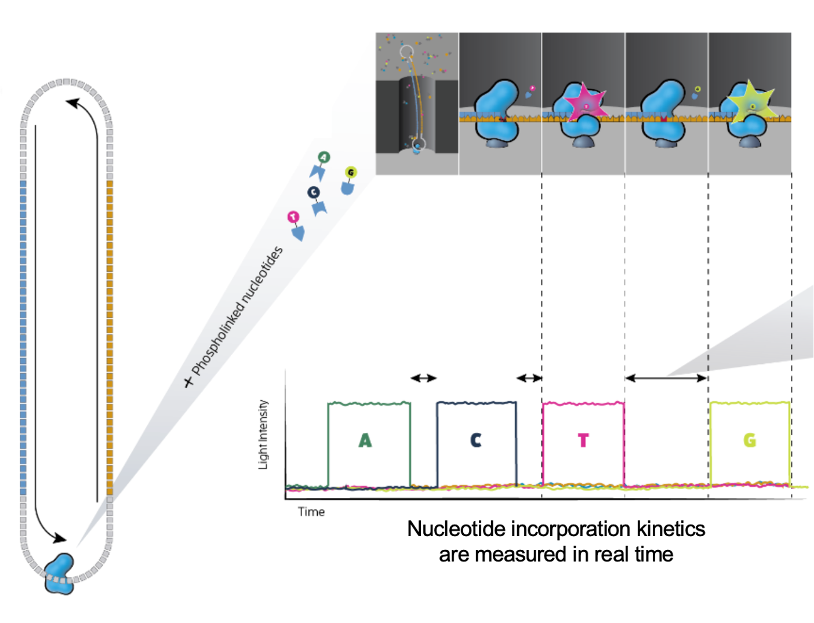

# DNA Sequencing, the long and the short of it.

*Matt Settles, PhD, University of California, Davis*

## Introduction to PacBio Sequencing

Pacific Biosciences (PacBio) was founded in 2004 with its underlying technology: Single Molecule, Real-Time (SMRT) Sequencing. Its first commercial sequencer (the RS) was released in 2010. Since that time there have been 4 sequencer updates: RS II, Sequel, Sequel 2, Sequel 2e.  

|                                     | Sequel IIe System |
| ----------------------------------- | ----------------- |
| Supported SMRT Cell                 | SMRT Cell 8M      |
| Number of HiFi Reads >99%* Accuracy | Up to 4,000,000   |
| Sequencing Run Time per SMRT Cell   | Up to 30 hrs      |

### PacBio's Main Features Include:

#### Long Reads
- Tens of kilobases
- Sequence from 500 bp to >50,000 bp inserts

#### High Accuracy
- Free of systematic errors
- Achieves >99.999% (Q50) consensus accuracy

#### Single-Molecule Resolution
- Sequence DNA or RNA
- Long reads with ≥Q20 (99%) single-molecule accuracy

#### Uniform Coverage
- No DNA amplification
- Least GC content and sequence complexity bias

#### Simultaneous Epigenetic Detection
- Characterize epigenome
- No separate sample preparation required

### The Basics of Sequencing on PacBio

### The SMRTbell produces polymerase reads

PacBio "movies" generate zmw polymerase reads that are comprised of the bell adapter, template forward strand subread, bell adapter, template reverse strand subread. Highly accurate long reads are then produced by the circular consensus sequence (CCS).

#### PacBio sequecing has two modes
- Continuous Long Reads: : Reads with a subread length approximately equivalent to the polymerase read length indicating that the sequence is generated from a single continuous template from start to finish. The CLR sequencing mode emphasizes the longest possible reads.
- HiFi Reads: The consensus sequence resulting from alignment between subreads taken from a single ZMW. Generating a CCS read does not include or require alignment against a reference sequence but does require at least two full-pass subreads from the insert. CCS reads are advantageous for amplicon and RNA sequencing projects and are highly accurate (>99% accuracy, Q>20).

Reads length distribution

#### Benefits of HiFi
- Highly accurate de novo assembly
- Detect all variants types with high precision and recall
- Detect 5% more variants in “medical exome” - Phase variants into haplotypes
- Sequence full-length transcripts
- Explore metagenomes in high resolution

Pacific Biosystems [You Tube](https://www.youtube.com/user/PacificBiosciences) channel has many quality videos that further explains their technology and applications.

## PacBio Data
