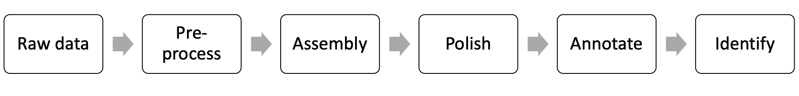
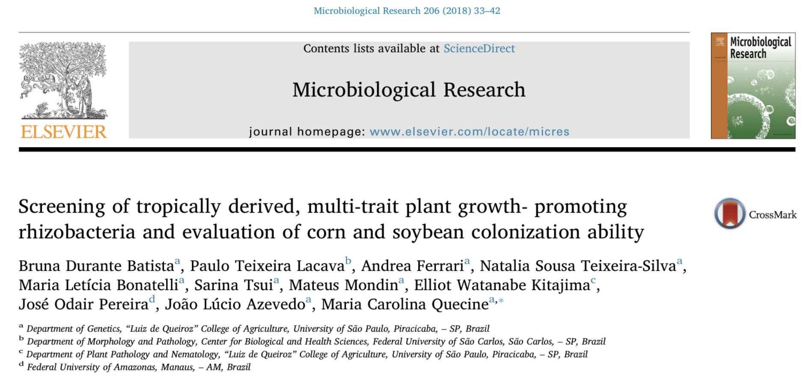

# Hands-on Workshop Assembling and Annotating Bacterial Genomes Using PacBio Long Reads

This workshop aims to provide to the participants the basic knowledge from beginning to end to assemble near-complete or complete high-quality bacterial genomes from PacBio long reads.

1. Introduction to PacBio sequencing data. Matthew Settles; Univ. of California, Davis, Davis, CA
2. Bacterial genome assembling with PacBio data. Hannah Lyman; Univeristy of California, Davis, Davis, CA
3. Annotating High-quality Bacterial Genomes. Jie Li; Univ. of California, Davis, Davis, CA
4. Bacterial Taxonomy with Whole-genome Data. Maria Bonatelli; Univ. of São Paulo, Piracicaba, Brazil

## The bacterium _Bacillus thuringiensis_ RZ2MS9
Today, you will assemble the genome of a bacterium that was isolated from the Amazon rainforest, in the city of Maués, Amazonas state, Brazil.
This bacterium was isolated from the rizosphere of guarana plants (_Paullinia cupana_).

r

The _Bacillus thuringiensis_ RZ2MS9 is a plant growth-promoting bacteria, so it harbors several genes related with plant growth-promoting traits, such as the production of indole acetic acid, solubilization of phosphate, and more.

Read the paper: [Batista et al. 2018](https://www.sciencedirect.com/science/article/pii/S0944501317309229).

## Contacts

    * Dr. Matt Settles <settles@ucdavis.edu>, Director, UC Davis Bioinformatics Core

## Computing needs

The quantity of data storage and the amount of processing needed should be sufficient on most laptop systems; however, many of the application used in the workshop requires the ability to compile code on a command line. As such we expect you to have these tools available on your system in order to fully participate.

### The applications that need to be first installed are:

1. [Samtools](http://www.htslib.org/)
2. [Bamutil](https://github.com/statgen/bamUtil/)
3. [ccs](https://github.com/PacificBiosciences/ccs/)
4. [Canu](https://canu.readthedocs.io/en/latest/index.html)
5. [GenomicConsensus](https://github.com/PacificBiosciences/GenomicConsensus)
6. [HTStream](https://s4hts.github.io/HTStream/)
7. [bwa-mem2](https://github.com/bwa-mem2/bwa-mem2)
8. [Pilon](https://github.com/broadinstitute/pilon/wiki)
9. [BLAST](https://www.ncbi.nlm.nih.gov/books/NBK279690/)
10. [Barrnap](https://github.com/tseemann/barrnap)
11. [FastANI](https://github.com/ParBLiSS/FastANI)

## Data Availability

    The data files needed for this workshop can be found [here](https://bioshare.bioinformatics.ucdavis.edu/bioshare/view/2021-ASM-genome-assembly/) on our Bioshare application. Please download all these data to your computers before continuing on.

## Workshop Materials

* This Bacterial Genome Assembly Workshop

   [https://ucdavis-bioinformatics-training.github.io/2021-ASM-genome-assembly/](https://ucdavis-bioinformatics-training.github.io/2021-ASM-genome-assembly/)
